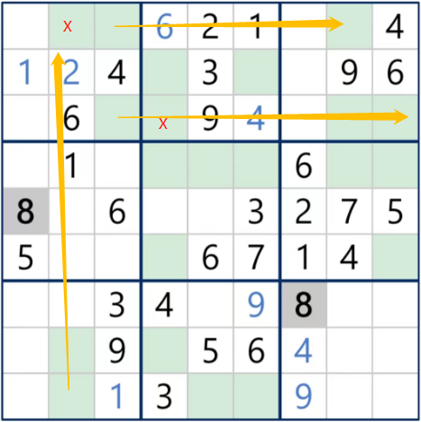
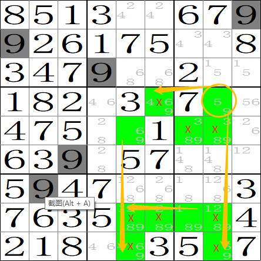

一种快速生成数独的方法。依赖eigen 3，需要C++11支持。

# 基础知识
约定4种解题技巧，对应4种难度。
1. 唯一解：候选x在某一行/列/宫只出现一次，或某格只有一个候选，即可确定。
2. 宫线消去：如图

 

3. 闭环消去：在同一行/列/宫的未知格中，若某n格中只可能是n个数字，别的格子中可以排除这些数字；若某n个数字只出现在n个格子中，这些格子中可以排除别的数字；若候选x在某n列（行）中只出现在n行（列）中，这些行（列）中其它列（行）可以排除x。
4. 假设消去：如图

 

   PS：假设消去完全兼容宫线消去，兼容闭环消去的第3种情况。

会这4种技巧就算是入门了，更高级的技巧暂未实现。用这4种技巧无法解题，却有唯一解的，定为难度5。

# 生成答案
首先在第1、5、9宫中各自填入集合[1，9]的一种随机排列，如：

        145000000
        927000000
        836000000
        000732000
        000865000
        000491000
        000000786
        000000351
        000000924

然后用深搜求解。

# 生成原题
1. 在答案中随机取30个数，其余删去；
2. 用唯一法求解，直至无解；
3. 在未填的格子中，取候选数量最多的，填入正确答案；
4. 重复2~3，直到填满81个数；
5. 1、3中的数字加起来即是原始题目。

# 精简
对原题中每个点定个属性，如果删除这个点，不能保证唯一解，则该点为锚点。每次删除一个点，剩下的点属性会发生变化。锚点永远是锚点，非锚点能变成锚点。
基本原理是“删除非锚点，直至剩下的全是锚点”，在此基础上可以有很多方式。

# 控制难度
鉴定难度略。除了难度1，无法精准控制难度，只能用拉斯维加斯算法穷举。提供三种策略，在i7-12700H 2.30 GHz的机器上，O2优化，单线程跑程序，生成10000个数独，其运行时间与概率密度如下：

简单概率最高，用时：2803.26ms
| 难度  |      1       |      2       |       3      |     4        |       5      |
| ----|-------------|-------------|-------------|-------------|-------------|
| 分布  | 10000       |      0       |      0       |     0        |      0       |
| 期望(ms)  | 0.280326    |      /       |      /       |      /       |       /      |

中等概率最高，用时：8434.69ms
| 难度  |      1       |      2       |       3      |     4        |       5      |
| ----|-------------|-------------|-------------|-------------|-------------|
| 分布  | 1020        | 2423        | 725         | 2200        | 3632        |
| 期望(ms)  | 8.269303922 | 3.481093686 | 11.63405517 | 3.83395     | 2.322326542 |

困难概率最高，用时：11935.6ms
| 难度  |       1      |     2        |      3       |        4     |    5         |
| ----|-------------|-------------|-------------|-------------|-------------|
| 分布  | 1021        | 743         | 496         | 902         | 6838        |
| 期望(ms)  | 11.69010774 | 16.0640646  | 24.06370968 | 13.23237251 | 1.745481135 |

综合所述，生成一个数独，本方法表现如下：
| 难度  |       1      |     2        |      3       |        4     |    5         |
| ----|-------------|-------------|-------------|-------------|-------------|
| 最优(ms)  | 0.3        | 0.85         | 0.85         | 0.85         | 1.2        |
| 期望(ms)  | 0.3 | 3.48  | 11.63 | 3.83 | 1.75 |

